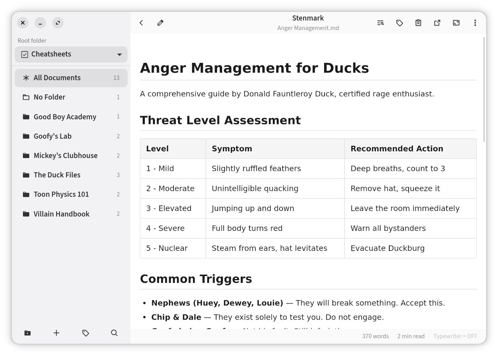
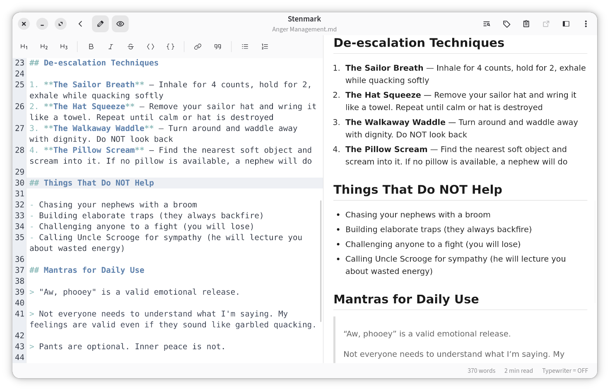
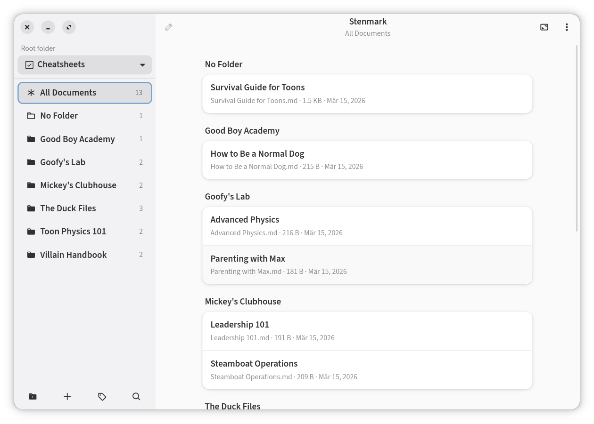

# Stenmark

Your markdown librarian. A GTK4 Markdown reader, organizer and editor.

> Early-stage release — expect rough edges. Feedback and bug reports welcome via Issues.


## Features

- Folder sidebar with document panel — browse and manage markdown files
- Subfolder navigation — drill into nested folders from the document panel
- Root folder switcher — quickly change scope via the sidebar header
- Open a file or directory from the command line: `stenmark ~/notes/` or `stenmark todo.md`
- External file handling — opening a file outside the root folder shows a sidebar prompt to navigate back to the root
- Frontmatter tags — add tags via YAML frontmatter (`tags: [a, b]`), edit with the tag popover in the header bar
- Tag filter pane (`Ctrl+T`) — select tags to find matching documents (AND logic); clickable tag chips on document rows
- Full-text search across documents (`Ctrl+Shift+F`) — scoped to the selected folder
- Quick filter on the document list (`Ctrl+F` on the documents page) — also matches tags
- Find in document (`Ctrl+F` in viewer) with customizable highlight colors
- WebKit-based rendered markdown view with syntax highlighting
- CodeMirror 6 editor with live preview pane and scroll sync
- 48 editor colour themes — Dracula, Nord, Gruvbox, Tokyo Night, VS Code, Solarized and friends — searchable in Preferences, with a colour preview beside the picker
- Edit where you were reading — double-click any text to open the editor with the caret on that word; switching back scrolls the reader to the line you were editing (double-click can be turned off in Preferences)
- Sidebar hides while editing, giving the editor and preview pane the full window width (optional, in Preferences)
- `Esc` leaves edit mode and saves (when the editor's find panel is open, the first `Esc` closes that instead)
- Dark mode — follows system theme
- File management — rename, move, trash, delete empty folders, create documents from context menu
- Pin folders to top — pinned folders appear first in the sidebar and document panel with a pin icon
- Pin documents to top — pinned documents float to the top of their folder; click the pin icon to unpin
- File watching — auto-reloads on disk changes
- Document linking — click relative markdown links (e.g. `[notes](../notes.md)`) to navigate between documents; external links open in the default browser
- Link navigation history — go back/forward with Alt+Left/Right, mouse side buttons, or the right-click context menu
- Task list checkboxes — toggle directly in the rendered view
- Table of contents popover — navigate headings, click to scroll
- Export to PDF (via menu), open in external app, copy as rich text
- Welcome screen with root directory setup prompt when no folder is configured
- Remember last folder across sessions (optional, in Preferences)
- Configurable keyboard shortcuts, fonts, and themes
- Translated interface — English and German, switchable in Preferences (see [TRANSLATING.md](TRANSLATING.md))

## Dependencies

- Python 3.10+
- GTK 4.0, libadwaita 1
- WebKitGTK 6.0
- python-markdown, Pygments, PyYAML
- Meson, Ninja, gettext (build)

## Install

### Flatpak

Stenmark is not on Flathub — their policy doesn't allow AI-assisted apps, and
Stenmark is — so it has [its own Flatpak repository](https://mkay.github.io/stenmark-flatpak/):

```sh
flatpak remote-add --user stenmark https://mkay.github.io/stenmark-flatpak/stenmark.flatpakrepo
flatpak install stenmark de.singular.stenmark
```

Updates then arrive with `flatpak update`. The GNOME runtime comes from Flathub,
so that remote has to exist too:

```sh
flatpak remote-add --if-not-exists --user flathub https://dl.flathub.org/repo/flathub.flatpakrepo
```

### Arch Linux

```bash
pacman -S python python-gobject gtk4 libadwaita webkitgtk-6.0 python-markdown python-pygments python-yaml meson ninja
makepkg -sic
```

### Debian / Ubuntu

```bash
sudo apt install ./stenmark_*.deb
```

### From source

```bash
meson setup builddir --prefix=/usr
meson compile -C builddir
sudo meson install -C builddir
```

## Usage

```bash
stenmark                        # opens the configured root directory
stenmark ~/Documents/Notes/     # opens a specific directory (session only)
stenmark ~/Notes/todo.md        # opens a file directly (sidebar hidden)
```

## Configuration

Settings are stored in `~/.config/stenmark/settings.json` and can be changed from the Preferences dialog. All changes take effect immediately, except the interface language, which applies on restart.

## License

GPL-3.0-**only** — version 3 of the GNU General Public License, and not "or any later version".
The full text is in [LICENSE](LICENSE), the copyright notice in [COPYRIGHT](COPYRIGHT).

### Artwork and name

The application icon is licensed separately, under **CC BY 4.0**.
[COPYRIGHT](COPYRIGHT) lists the files.

The **name** is not licensed by either grant — give a fork its own.

## Credits

Stenmark bundles the following, both GPL-compatible — [COPYRIGHT](COPYRIGHT) has the details:

- [Phosphor Icons](https://phosphoricons.com/) (MIT) — the toolbar and sidebar icons
- [CodeMirror 6](https://codemirror.net/) (MIT) — the bundled editor

Translations are contributed by native speakers — see [TRANSLATING.md](TRANSLATING.md) if you would like to add yours.

## Screenshots







## Disclaimer

This project was developed with AI assistance. The code has been analysed with Codacy and Bandit. Use at your own discretion.  
[](https://app.codacy.com/gh/mkay/stenmark/dashboard)